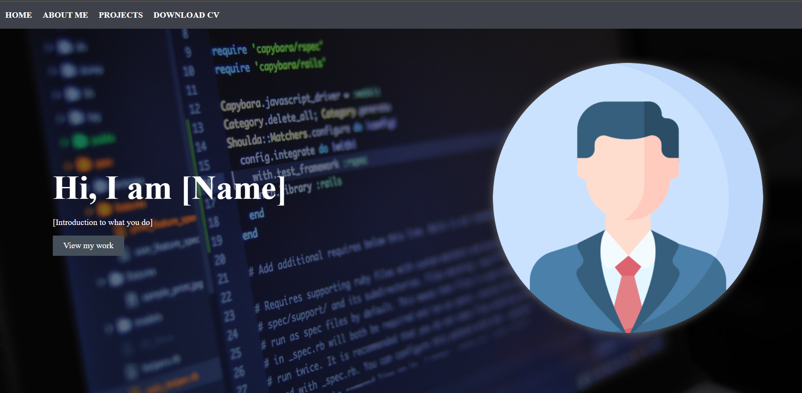
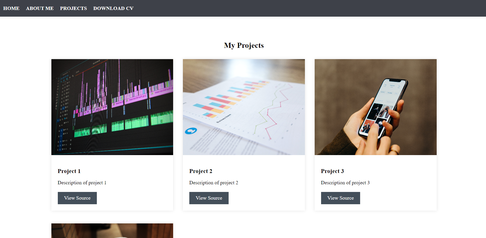

# Portofolio Template

This is a free to use template that I made when I was bored. Feel free to use it, modify it & share it how you like. The idea of this portofolio is to give developers with no experience in webdev a base template that they can modify and create a solid portofolio for their projects.

`Note` that I am not a profesional web developer and this portofolio was made with bare minimum knowledge and chat gpt
information.

## Images
---

---

---

## Components

This site is made from basic html and css and has the next sections:

- `The header bar` with links to all important sections
- `The hero section` which is the first section it shows when a user enter our website
- `The about section` with informations about us and our skillset
- `The projects section` where we have listed all our projects
- `The footer` with contact information

Feel free to contribute however you can to this project!